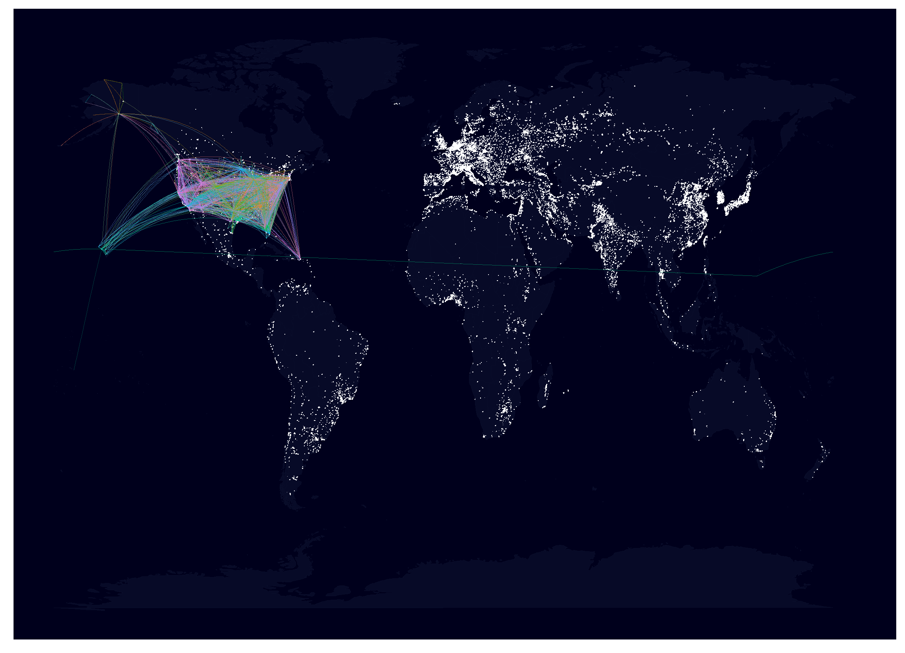

# Flight Survey Project
## IST687 - Introduction to Data Science with R

### Goals
- Generate actionable insight from the flight survey dataset.
- Predict customers with low satisfaction.

### Descriptons of R Scripts
#### Data Cleaning, Transformation, Munging
DataCleaning.R
  Functions to be used to clean the Flight Survet dataset.

#### Exploratory Data Analysis
EDA.R

FlightMapping.R
  Creates a world map of all flight patterns in the dataset.

Vacay_scores.R
  

#### Modeling
ModelgFuncs.R
  Contains the model_trainer function that trains a model, predicts the results on the test data, and scores the model.

XGBoostModeling.R
  Script for training, evaluating, and scoring gradient boosting trees to understand important features in the data and build a good prediction model.

SVMModeling.R
  Training Support Vector Machine classification models.

NaiveBayesModeling.R
  Training Naive Bayes classification models.  